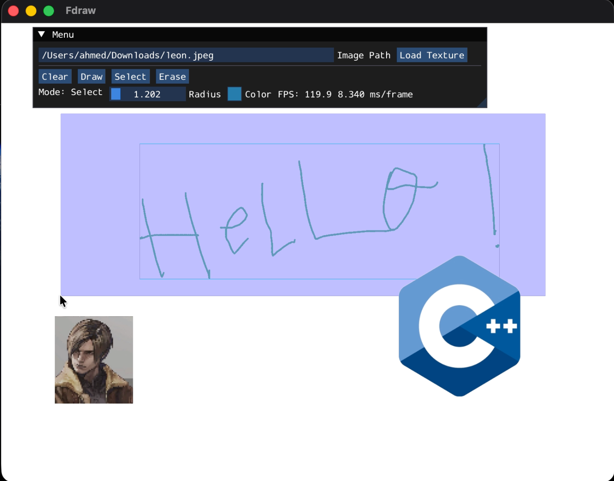

# FDraw

Drawing application built with C++ and OpenGL.



## Getting Started

### 1. Clone the Repository
Clone the main repository to your local machine:
```bash
git clone <repository-url>
cd <repository-folder>
```

### 2. Initialize Submodules
The project uses Git submodules, you must initialize and clone them after cloning the main repository:
```bash
git submodule update --init --recursive
```
*(Alternatively, you can clone everything at once using `git clone --recurse-submodules <repository-url>`)*

### 3. Build and Run
Configure the project with CMake, compile, and run the executable:
```bash
cmake -S . -B build/
cd build
make && ./prog
```
